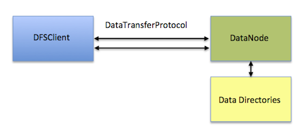
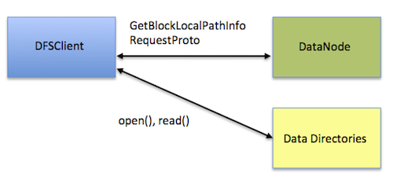
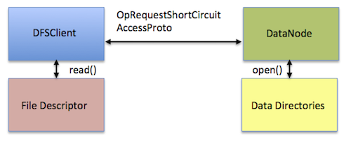

# 12. 하둡2 소개

## 12.7 쇼트 서킷 조회
> 모든 분산파일 시스템은 당연히 데이터노드를 통해서만 액세스가 가능하지만, 생각해보면 맵리듀스나 별도의 타스크가 실행되는 경우에도 항상 데이터노드를 통하기 때문에 불필요한 접근이 지속적으로 발생한다. 이러한 단점을 해소하기 위해 나온 것이 **쇼트 서킷 조회**인데, DFSClient가 DataTransferProtocol을 통해 데이터 노드와 통신하는 경우 HDFS의 어느 블록에 접근하더라도 TCP 소켓 비용이 발생하는데, 이 말은 블록 접근이 많으면 많을수록 소켓통신의 빈도도 같이 높아진다는 의미입니다. 원격지 블록은 어쩔 수 없지만, 로컬블록인 경우에는 성능저하의 원인 중 하나로 알려져 있습니다.

### [What is short circuit read?](http://www.openkb.info/2014/06/what-is-short-circuit-local-reads.html)
* 기존의 파일읽기는 항상 DataTransferProtocol을 통해 데이터노드의 TCP 통신이 발생한다


* 최초 접근 시에는 GetBlockLocalPathInfo를 통해 블록의 위치를 조회하고 이후부터는 로컬파일을 직접 읽고, 쓸 수 있게 된다. 다만 SSH 인증을 받은 계정만 사용할 수 있다 [HDFS-2246]

```hdfs-site.xml
<property>
    <name>dfs.client.read.shortcircuit</name>
    <value>true</value>
    <description>This configuration parameter turns on short-circuit local reads.</description>
</property>

<property>
    <name>dfs.block.local-path-access.user</name>
    <value>gpadmin,hdfs,mapred,yarn,hbase,hive</value>
    <description>User that can use the shortcut</description>
</property>

<property>
    <name>dfs.client.read.shortcircuit.skip.checksum</name>
    <value>false</value>
    <description>If this configuration parameter is set, short-circuit local reads will skip checksums. This is normally not recommended, but it may be useful for special setups. You might consider using this if you are doing your own checksumming outside of HDFS.</description>
</property>
```

* 안전한 쇼트서킷 읽기

```hdfs-site.xml
<property>
  <name>dfs.client.read.shortcircuit</name>
  <value>true</value>
  <description>
    This configuration parameter turns on short-circuit local reads.
  </description>
</property>

<property>
  <name>dfs.domain.socket.path</name>
  <value>/home/stack/sockets/short_circuit_read_socket_PORT</value>
  <description>
    Optional.  This is a path to a UNIX domain socket that will be used for
    communication between the DataNode and local HDFS clients.
    If the string "_PORT" is present in this path, it will be replaced by the
    TCP port of the DataNode.
  </description>
</property>

<property>
  <name>dfs.client.read.shortcircuit.streams.cache.size</name>
  <value>256</value>
  <description>
    The DFSClient maintains a cache of recently opened file descriptors. This parameter controls the size of that cache. Setting this higher will use more file descriptors, but potentially provide better performance on workloads involving lots of seeks.
  </description>
<property>

<property>
  <name>dfs.client.read.shortcircuit.streams.cache.expiry.ms</name>
  <value>300000</value>
  <description>
    This controls the minimum amount of time file descriptors need to sit in the FileInputStreamCache before they can be closed for being inactive for too long.
  </description>
<property>
```


## 12.8 헤테로지니어스 스토리지

### 12.8.1 스토리지 시장의 변화
> SSD 성능과 가격정책에 따라 HDD 시장은 더 이상 7200RPM 이상의 속도전을 할 필요 없이 더 튼튼한, 고밀도 저장소로 방향을 전환하여 플래터 회전속도가 5400 ~ 5900 RPM으로 낮추고 단일 드라이브 용량이 4TB를 넘기면서 기록 밀도를 높이는 추세이다. 즉 RPM이 낮을수록 높은 기록 밀도에서의 읽기/쓰기 제어가 좋아지고 안정성도 향상되기 때문이다. 메모리 또한 128 ~ 256GB가 대중화 되어 일반적으로 사용되고 있다.

### 12.8.2 헤테로지니어스 스토리지란?
> HDFS가 서로 다른 종류의 스토리지 유형을 구분할 수 없기 때문에, 네임노드는 모든 데이터노드가 동일한 스토리지를 사용한다고 인지하는 문제 때문에 고안된 것인데, 스토리지의 성능과 특성에 맞게 블록 복제본이 저장될 스토리지를 선택할 수 있는 기능을 말한다. 이러한 방식에 따라 DISK, SSD, RAM_DISK 및 ARCHIVE 모드로 디스크 별로 설정이 가능하다

### 12.8.3 스토리지 정책
> HDFS에 저장하는 보관주기 워크로드에 따라 다양한 액세스 패턴을 가지는데 이에 따라 HOT, WARM, COLD, ONE_SSD, ALL_SSD 및 LAZY_PERSIST 방식으로 정책을 변경할 수 있으며, mover를 통해 정책에 맞지 않는 데이터를 재조정하는 것이 가능하다. 예를 들어 디스크 2개와 SSD 1개로 구성된 4대의 데이터노드가 있고, dfs.datanode.data.dir 속성에 DISK, SSD로 태그 되어있다고 가정하는 경우 아래와 같이 ssd_only 정책이 결정된 경로에 파일을 업로드 하는 경우 실제 물리적으로 SSD인 노드와 디스크에 저장되어 빠른 읽기 제공이 가능하게 됩니다.

```bash
    bin/hdfs dfs -mkdir /data/ssd_only
    bin/hdfs storagepolicies -setStoragePolicy -path /data/ssd_only -policy ALL_SSD
```
 


